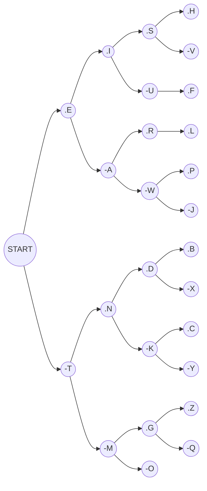

# Morse Code Chatting
A little game for two-person chatting with morse code.

## Morse Code 

```mermaid
graph LR
s(("START"))
E((".E"))
T(("-T"))
I((".I"))
A(("-A"))
N((".N"))
M(("-M"))
S((".S"))
U(("-U"))
R((".R"))
W(("-W"))
D((".D"))
K(("-K"))
G((".G"))
O(("-O"))
H((".H"))
V(("-V"))
F((".F"))
L((".L"))
P((".P"))
J(("-J"))
B((".B"))
X(("-X"))
C((".C"))
Y(("-Y"))
Z((".Z"))
Q(("-Q"))

s-->E
s-->T
E-->I
E-->A
T-->N
T-->M
I-->S
I-->U
A-->R
A-->W
N-->D
N-->K
M-->G
M-->O
S-->H
S-->V
U-->F
R-->L
W-->P
W-->J
D-->B
D-->X
K-->C
K-->Y
G-->Z
G-->Q
```